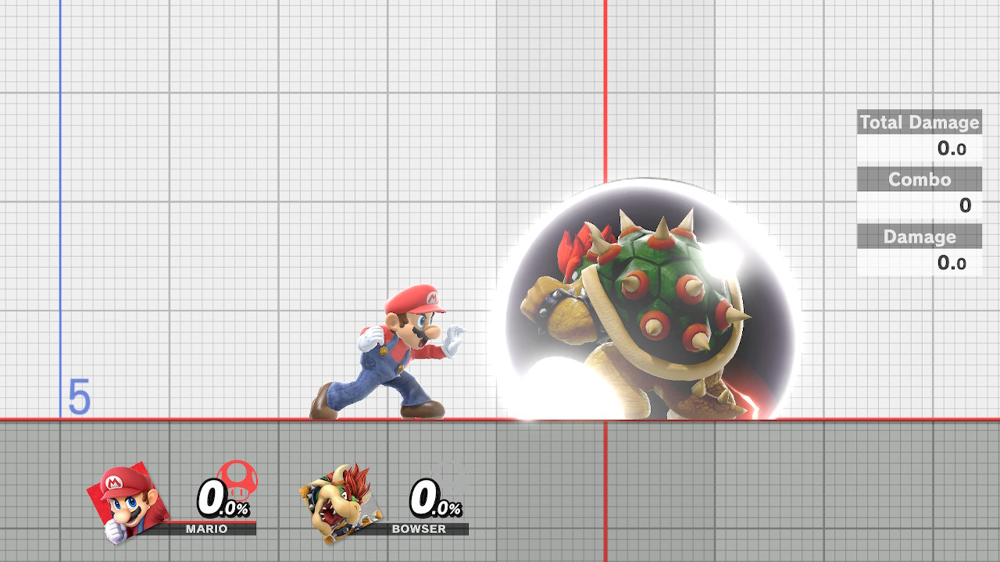
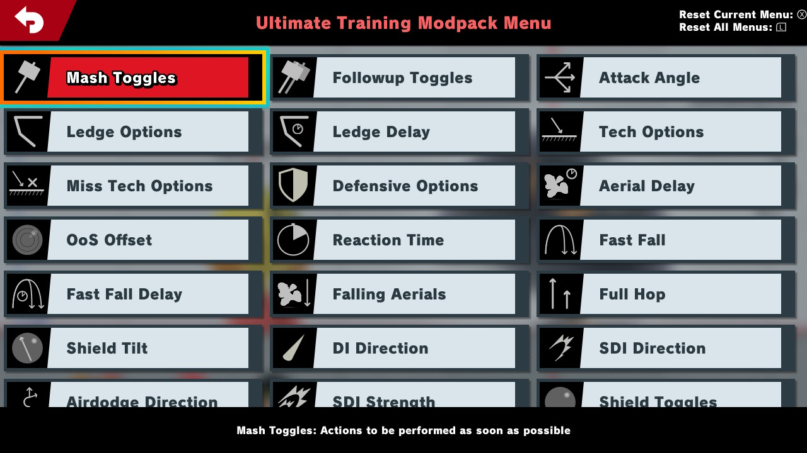
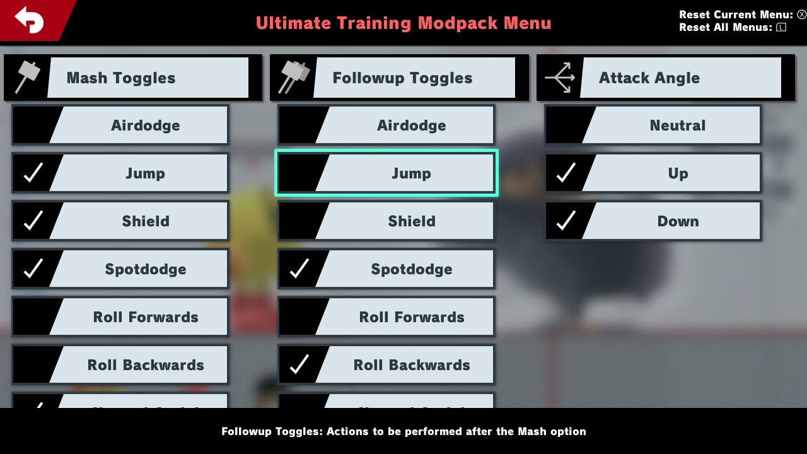

# Ultimate Training Modpack Plugin

[](https://github.com/jugeeya/UltimateTrainingModpack/releases)

[](https://github.com/jugeeya/UltimateTrainingModpack/actions)

[](https://discord.gg/qU4TBwV)

[](https://twitter.com/jugeeya)

A [Skyline](https://github.com/shadowninja108/Skyline) plugin using [cargo-skyline](https://github.com/jam1garner/cargo-skyline) for adding features to the training mode. It interfaces with [skyline-web](https://github.com/skyline-rs/skyline-web) to provide a menu for customizing training options.

The latest stable release can be found [here](https://github.com/jugeeya/UltimateTrainingModpack/releases/latest).

The latest beta release can be found [here](https://github.com/jugeeya/UltimateTrainingModpack/tree/beta).

-  [Features](#features)

-  [Installation](#installation)

-  [Frequently Asked Questions](#faq)

-  [Build Instructions](#build)

<a name="features"/>

# Features
The features in this modpack are configured through the menu, which can be accessed within training mode by pressing `SPECIAL+UPTAUNT`. Generally they fall into these categories:

- Enables or disables stage hazards
- Saves and loads the positional state of the player and CPU
- Displays additional information onscreen
- Controls CPU behavior





## Stage Hazards

Set stage hazards on or off in Training Mode! Use this to practice on tournament legal stages with hazards.


## Save States

At any time in Training Mode, you can press `Grab + Down Taunt` to save the state of training mode. This will save the position, state, and damage of each fighter, which can then be reverted to at any time with `Grab + Up Taunt`. With the mirroring setting,loading the save state will flip the positions, allowing you to practice your skills facing both directions. Use this instead of the built-in training mode reset!


## Input Delay

Practice with emulated extra input delay, in frames. Use this to practice with online's default delay.

## Frame Advantage

Practice moves on shield to find out the frame advantage of the moves performed. Best used with Infinite Shield. Can also be used to find the advantage on hit to determine appropriate followups.

## Hitbox Visualization
Currently, hitboxes and grabboxes are supported. When visualization is active, other move effects are temporarily turned off for easier visualization.

## CPU Behavior

The CPU can be instructed to perform a wide array of different actions in response to particular situations. The following situations are available:

- Mash: To be performed after being hit or shielding an attack
- Followup: To be performed as soon as possible after the mash option
- Ledge: To be performed when hanging on the ledge
- Tech: To be performed when slammed into the ground or wall
- Miss Tech: To be performed after failing to tech
- Defensive: To be performed after the ledge, tech, or miss tech option

The timing of the CPU option can be influenced by the following settings:

- Aerial Delay
- Ledge Delay
- OoS Offset
- Reaction Time
- Fast Fall Delay
- Falling Aerials
- Mash in Neutral

-----

## Menu Settings

When multiple options are selected, one of the selected options will be chosen at random. Open / focused menus can be reset by pressing the `X` button. All menus can be reset to the default by pressing the `L` button. These defaults can be saved upon exiting the menu by pressing `R` when in-menu. Use this to make a preset that fits your personal training style.


| Feature              | Description                                                                                 | Options                                                                                                           |
|----------------------|---------------------------------------------------------------------------------------------|-------------------------------------------------------------------------------------------------------------------|
| Mash Toggles         | Actions to be performed as soon as possible out of hitstun or shieldstun                    | Airdodge, jump, shield, spotdodge, roll in, roll out, aerials, jab, tilts, smash attacks, grab, dash, dash attack |
| Followup Toggles     | Actions to be performed after the Mash option                                               | Airdodge, jump, shield, spotdodge, roll in, roll out, aerials, jab, tilts, smash attacks, grab, dash, dash attack |
| Attack Angles        | For attacks that can be angled, such as some forward tilts                                  | Neutral, up, down                                                                                                 |
| Ledge Options        | Actions to be taken when on the ledge                                                       | Neutral getup, ledge roll, ledge attack, wait                                                                     |
| Ledge Delay          | How many frames to delay the ledge option                                                   | 0 to 300 frames (5 seconds) in increments of 10 frames                                                            |
| Tech Options         | Actions to take when slammed into a hard surface                                            | Miss tech, tech in place, tech roll in, tech roll out                                                             |
| Miss Tech Options    | Actions to take after missing a tech                                                        | Neutral getup, getup attack, roll in, roll out                                                                    |
| Defensive Options    | Actions to take after a ledge option, tech option, or miss tech option                      | Spotdodge, roll in, roll out, jab, shield                                                                         |
| Aerial Delay         | How long to delay a Mash aerial attack                                                      | 0 to 30 frames (0.5 seconds)                                                                                      |
| OoS Offset           | How many times the CPU shield can be hit before performing a Mash option                    | 0 to 30 hits                                                                                                      |
| Reaction Time        | How many frames to delay before performing an option out of shield                          | 0 to 30 frames (0.5 seconds)                                                                                      |
| Fast Fall            | Should the CPU fastfall during a jump                                                       | Yes, No                                                                                                           |
| Fast Fall Delay      | How many frames the CPU should delay their fastfall                                         | 0 to 30 frames (0.5 seconds)                                                                                      |
| Falling Aerials      | Should aerials be performed when rising or when falling                                     | Yes, No                                                                                                           |
| Full Hop             | Should the CPU perform a full hop or a short hop                                            | Yes, No                                                                                                           |
| Shield Tilt          | Direction to tilt the shield                                                                | Neutral, out, up-out, up, up-in, in, down-in, down, down-out, left, right                                         |
| DI Direction         | Direction to angle the directional influence during hitlag                                  | Neutral, out, up-out, up, up-in, in, down-in, down, down-out, left, right                                         |
| SDI Direction        | Direction to angle the smash directional influence during hitlag                            | Neutral, out, up-out, up, up-in, in, down-in, down, down-out, left, right                                         |
| Airdodge Direction   | Direction to angle airdodges                                                                | Neutral, out, up-out, up, up-in, in, down-in, down, down-out, left, right                                         |
| SDI Strength         | Relative strength of the smash directional influence inputs                                 | Normal (8 frames between SDI inputs), Medium (6 frames), High (4 frames)                                          |
| Shield Toggles       | CPU Shield Behavior                                                                         | None, Infinite (no shield damage or decay), Hold (no shield decay until the shield is hit for the first time), Constant (no shield decay)                                      |
| Mirroring            | Flips save states in the left-right direction across the stage center                       | None, Alternate, Random                                                                                           |
| Throw Options        | Throw to be performed when a grab is landed                                                 | None, Forward Throw, Back Throw, Up Throw, Down Throw                                                             |
| Throw Delay          | How many frames to delay the throw option                                                   | 0 to 150 frames (2.5 seconds) in increments of 5 frames                                                           |
| Pummel Delay         | How many frames after a grab to wait before starting to pummel                              | 0 to 150 frames (2.5 seconds) in increments of 5 frames                                                           |
| Input Delay          | Frames to delay player inputs by                                                            | 0 to 10 frames (0.167 seconds)                                                                                    |
| Save Damage          | Should save states retain player/CPU damage                                                 | Yes, No                                                                                                           |
| Hitbox Visualization | Should hitboxes be displayed, hiding other visual effects                                   | Yes, No                                                                                                           |
| Stage Hazards        | Should stage hazards be present                                                             | Yes, No                                                                                                           |
| Frame Advantage      | Display the time difference between when the player is actionable and the CPU is actionable | Yes, No                                                                                                           |
| Mash in Neutral      | Should Mash options be performed repeatedly or only when the CPU is hit                     | Yes, No                                                                                                           |

<a name="installation"/>

# Installation

The training modpack requires the following prerequisite packages:

* Atmosphere: https://github.com/Atmosphere-NX/Atmosphere/releases
* Skyline: https://github.com/skyline-dev/skyline/releases

To install the training modpack, download the .zip file from the [latest release page](https://github.com/jugeeya/UltimateTrainingModpack/releases/latest). Extract the files from the .zip file using the file explorer on Windows or Mac, or a program such as 7-zip (windows) or unzip (Linux). Then transfer the extracted contents onto the root of your SD card, merging the /atmosphere folder with the one on your SD card. No files need to be deleted when upgrading from a previous version. The SD card should have the below files at these locations.

```
SD Card Root
└── atmosphere
    └── contents
        └── 01006A800016E000
            ├── manual_html
            │   └── html-document
            │       └── contents.htdocs
            │           ├── aerial_delay.svg
            │           ├── air_dodge_dir.svg
            │           ├── attack_angle.svg
            │           ├── check.svg
            │           ├── defensive_state.svg
            │           ├── di_state.svg
            │           ├── falling_aerials.svg
            │           ├── fast_fall.svg
            │           ├── fast_fall_delay.svg
            │           ├── follow_up.svg
            │           ├── frame_advantage.svg
            │           ├── full_hop.svg
            │           ├── input_delay.svg
            │           ├── ledge_delay.svg
            │           ├── ledge_state.svg
            │           ├── mash_in_neutral.svg
            │           ├── mash_state.svg
            │           ├── miss_tech_state.svg
            │           ├── oos_offset.svg
            │           ├── pummel_delay.svg
            │           ├── reaction_time.svg
            │           ├── save_damage.svg
            │           ├── save_state_mirroring.svg
            │           ├── sdi_state.svg
            │           ├── sdi_strength.svg
            │           ├── shield_state.svg
            │           ├── shield_tilt.svg
            │           ├── stage_hazards.svg
            │           ├── tech_state.svg
            │           ├── throw_delay.svg
            │           └── throw_state.svg
            └── romfs
                └── skyline
                    └── plugins
                        ├── libnn_hid_hook.nro
                        ├── libnro_hook.nro
                        ├── libparam_hook.nro
                        └── libtraining_modpack.nro
```

To install a beta version of the modpack, follow the same procedure using the [latest beta release](https://github.com/jugeeya/UltimateTrainingModpack/tree/beta) on Github. Beta releases may have additional features and bugfixes, but are subject to change.

<a name="faq"/>

# Frequently Asked Questions

* Can my Switch run the Training Modpack?
    * Your switch has to be hackable, which means it needs to be an early enough unit. You can check at https://ismyswitchpatched.com/ .
* Is this mod wifi-safe?
    * Yes*. Smash online is client sided. What this means is when playing against an opponent, their instance of the game is separate from your instance of the game, and when the server sends over data from the other player, it is replicated on your screen. Desyncs arise from when properties from the other side differ from what your game expects. (For example, Mario’s Forward Smash dealing 95% instead of its’ normal amount of damage). Because Training Modpack is only available while using Training Mode, the training modpack is safe to use while using online games. However, you should recognize that mods are not sanctioned by Nintendo and that there is always some ban risk associated with using them. Use this mod and others at your own risk.
* Is this mod compatible with Yuzu or other emulators?
    * No, emulators do not support Skyline yet, which is the code framework this mod works under. However, if those emulators add Skyline support at some point in the future, then it may be possible for the training modpack to run on those platforms.
* Can I change the button combination to bring up the menu?
    * No, this is not currently supported. Use `SPECIAL+UPTAUNT` to open the menu.
* How do I fix the error message "The software has been closed due to an error" when starting Smash?
    * If you're on a Mac, check your SD card for files with dots at the beginning of them in the training mod files, they should be deleted (like, `._libtraining_modpack.nro` in addition to `libtraining_modpack.nro`).
* How do I fix the error message "Failed to open sdmc:/atmosphere/package3"?
    * This is caused by improperly setting up the SD card. When adding files onto the SD card, make sure that you extract the contents of the .zip file first then add only the contents and not the parent folder onto the SD card! Consult the [Atmosphere documentation](https://github.com/Atmosphere-NX/Atmosphere) for additional information.
* How do I fix the error message "Panic occurred while running Atmosphere. Title ID: 010041544D530000 Error: std::abort (0xFFE)
    * This is caused by a missing or improper [Skyline](https://github.com/skyline-dev/skyline/releases) installation. Make sure that you install the `subsdk9` and `main.npdm` files to `atmosphere/contents/01006A800016E000/exefs/`, as indicated in the Installation instructions.
* How do I remove the Training Mod?
    * It's as simple as removing the files associated with the modpack. Make sure you only remove the files that you wish to remove:
        * Modpack plugins
            * `atmosphere/contents/01006A800016E000/romfs/skyline/plugins/libnn_hid_hook.nro`
            * `atmosphere/contents/01006A800016E000/romfs/skyline/plugins/libnro_hook.nro`
            * * `atmosphere/contents/01006A800016E000/romfs/skyline/plugins/libparam_hook.nro`
            * `atmosphere/contents/01006A800016E000/romfs/skyline/plugins/libtraining_modpack.nro`
        * Additional static files
            * `atmosphere/contents/01006A800016E000/manual_html/html-document/contents.htdocs/*`
            * `TrainingModpack/*` (which is generated by the modpack)
    * Make sure that you only remove the files that you don't want on your SD card anymore (e.g. don't remove skyline if you have other skyline plugins)
* What features are under development?
    * Check the [Projects Tab on Github](https://github.com/jugeeya/UltimateTrainingModpack/projects) and the Discord for the latest information on new development
* How do I contribute to the modpack?
    * Pull requests to the project repository are welcome for new features and bugfixes.

<a name="build"/>

# Build from Source

If you'd like to build the modpack starting from the source code, you can build the NRO using the standard command for skyline plugins:

```bash
cargo skyline build --release
```

To build the entire modpack including supporting files, use the steps in [`full_build.sh`](full_build.sh) or in the [Github Actions specification file](https://github.com/jugeeya/UltimateTrainingModpack/blob/master/.github/workflows/rust.yml).

## Prerequisites
- Stable Rust environment with [cargo-skyline](https://github.com/jam1garner/cargo-skyline)
- [DEVKITPRO](https://devkitpro.org/wiki/Getting_Started) `switch-dev` installation