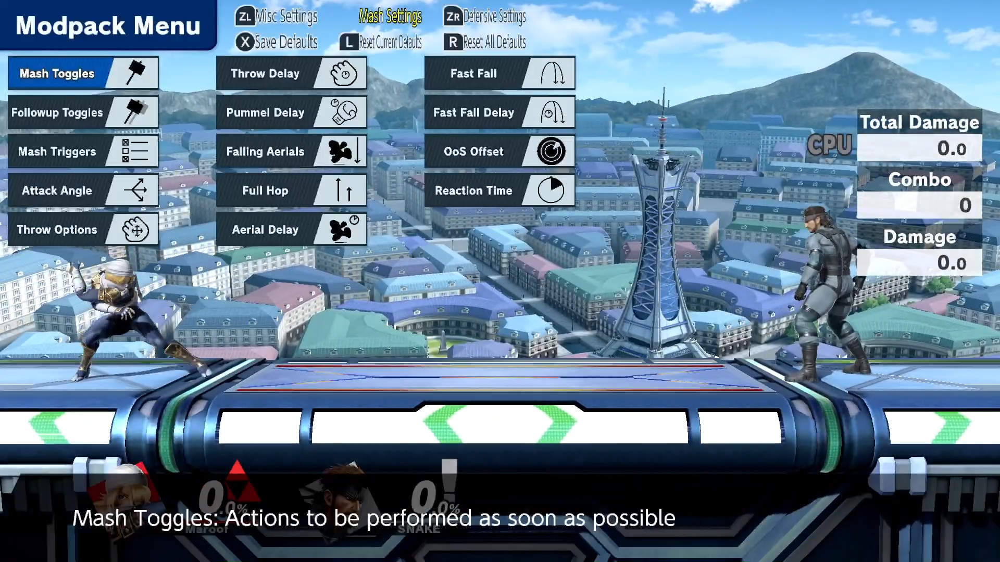

# Ultimate Training Modpack Plugin

<div align="center">

[](https://github.com/jugeeya/UltimateTrainingModpack/releases)

[](https://github.com/jugeeya/UltimateTrainingModpack/actions)

[](https://discord.gg/xUZWJ5BWe7)

[](https://twitter.com/jugeeya)

</div>

A [Skyline](https://github.com/shadowninja108/Skyline) plugin using [cargo-skyline](https://github.com/jam1garner/cargo-skyline) for adding features to the training mode. It uses native Smash UI to provide a menu for customizing training options.


The latest stable release can be found [here](https://github.com/jugeeya/UltimateTrainingModpack/releases/latest).

The latest beta release can be found [here](https://github.com/jugeeya/UltimateTrainingModpack/releases/tag/beta).


-  [Beta Changelog](#beta-changelog)

-  [Features](#features)

-  [Installation](#installation)

-  [Frequently Asked Questions](#faq)

-  [Build Instructions](#build)


<a name="features"/>

# Features
The features in this modpack are configured through the menu, which can be accessed within training mode by pressing `SPECIAL+UPTAUNT`. Generally they fall into these categories:

- **Mash Settings**; **Defensive Settings**: Controls CPU behavior
- **Save State Settings**: Saves and loads the positional state of the player and CPU
- **Miscellaneous Settings**: Displays additional information onscreen, enables or disables stage hazards

## Menu Settings

When multiple options are selected, one of the selected options will be chosen at random. Open / focused menus can be reset by pressing the `Y` button. All menus can be reset to the default by pressing the `Z`/`ZR` button. These defaults can be saved upon exiting the menu by pressing `X` when in-menu. Use this to make a preset that fits your personal training style.

### Mash Settings



<details><summary>Click here for setting descriptions...</summary>

| Feature | Description | Options |
|:---:|:---|:---|
| Mash Toggles | Actions to be performed as soon as possible out of hitstun or shieldstun | Airdodge, jump, shield, spotdodge, roll in, roll out, aerials, jab, tilts, smash attacks, grab, dash, dash attack |
| Followup Toggles | Actions to be performed after the Mash option | Airdodge, jump, shield, spotdodge, roll in, roll out, aerials, jab, tilts, smash attacks, grab, dash, dash attack |
| Mash Triggers | Conditions which will cause the CPU to perform their mash action | Hitstun, shieldstun, parry, tumble, landing, ledge trump, footstool, clatter, ledge option, tech option, grounded, airborne, distance: close, distance: mid, distance: far, always |
| Attack Angles | For attacks that can be angled, such as some forward tilts | Neutral, up, down |
| Throw Options | Throw to be performed when a grab is landed | None, Forward Throw, Back Throw, Up Throw, Down Throw |
| Throw Delay | How many frames to delay the throw option | 0 to 150 frames (2.5 seconds) in increments of 5 frames |
| Pummel Delay | How many frames after a grab to wait before starting to pummel | 0 to 150 frames (2.5 seconds) in increments of 5 frames |
| Falling Aerials | Should aerials be performed when rising or when falling | Yes, No |
| Full Hop | Should the CPU perform a full hop or a short hop | Yes, No |
| Aerial Delay | How long to delay a Mash aerial attack | 0 to 30 frames (0.5 seconds) |
| Fast Fall | Should the CPU fastfall during a jump | Yes, No |
| Fast Fall Delay | How many frames the CPU should delay their fastfall | 0 to 30 frames (0.5 seconds) |
| OoS Offset | How many times the CPU shield can be hit before performing a Mash option | 0 to 30 hits |
| Reaction Time | How many frames to delay before performing an option out of shield | 0 to 30 frames (0.5 seconds) |


</details>

### Defensive Settings

<details><summary>Click here for setting descriptions...</summary>

| Feature | Description | Options |
|:---:|:---|:---|
| Airdodge Direction | Direction to angle airdodges | Neutral, out, up-out, up, up-in, in, down-in, down, down-out, left, right |
| DI Direction | Direction to angle the directional influence during hitlag | Neutral, out, up-out, up, up-in, in, down-in, down, down-out, left, right |
| SDI Direction | Direction to angle the smash directional influence during hitlag | Neutral, out, up-out, up, up-in, in, down-in, down, down-out, left, right |
| SDI Strength | Relative strength of the smash directional influence inputs | None, Normal (8 frames between inputs), Medium (6 frames), High (4 frames) |
| Clatter Strength | Relative strength of mashing out of grabs, buries, etc. | None, Normal (8 frames between inputs), Medium (6 frames), High (4 frames) |
| Ledge Options | Actions to be taken when on the ledge | Neutral getup, ledge roll, ledge attack, wait |
| Ledge Delay | How many frames to delay the ledge option | 0 to 300 frames (5 seconds) in increments of 10 frames |
| Tech Options | Actions to take when slammed into a hard surface | Miss tech, tech in place, tech roll in, tech roll out |
| Mistech Options | Actions to take after missing a tech | Neutral getup, getup attack, roll in, roll out |
| Shield Toggles | CPU Shield Behavior | None, Infinite (no shield damage or decay), Hold (no shield decay until the shield is hit for the first time), Constant (no shield decay) |
| Shield Tilt | Direction to tilt the shield | Neutral, out, up-out, up, up-in, in, down-in, down, down-out, left, right |
| Crouch | Should the CPU crouch when on the ground | Yes, No |

</details>


The CPU can be instructed to perform a wide array of different actions in response to particular situations. The following situations are available:

- Mash: To be performed after being hit or shielding an attack
- Followup: To be performed as soon as possible after the mash option
- Ledge: To be performed when hanging on the ledge
- Tech: To be performed when slammed into the ground or wall
- Miss Tech: To be performed after failing to tech
- Hitstun
- Shieldstun
- Parry
- Tumble
- Landing
- Ledge Trump
- Footstool
- Clatter ("Mashing out" of grabs, freeze, bury, etc.)
- Ledge Option
- Tech Option
- Grounded
- Airborne
- Distance: Close
- Distance: Mid
- Distance: Far
- Always

The timing of the CPU option can be influenced by the following settings:

- Mash Triggers
- Aerial Delay
- Ledge Delay
- OoS Offset
- Reaction Time
- Fast Fall Delay
- Falling Aerials


### Save State Settings


<p align="center">


</p>
<details><summary>Click here for setting descriptions...</summary>

| Feature | Description | Options |
| :---: | :--- | :--- |
| Mirroring | Flips save states in the left-right direction across the stage center | None, Alternate, Random |
| Save Damage | Should save states retain player/CPU damage | Yes, No |
| Save States Autoload | Load save state when any fighter dies | Yes, No |
| Save Damage (CPU) | What to use for CPU's damage on save state load | Default, Save State, Random |
| Damage Range (CPU) | Random percentage for save state load for CPU | 0 to 150 % |
| Save Damage (Player) | What to use for player's damage on save state load | Default, Save State, Random |
| Damage Range (Player) | Random percentage for save state load for player | 0 to 150 % |
| Enable Save States | Should save states be enabled or disabled | Yes, No |
| Save State Slot | Save and load states from different slots | 1, 2, 3, 4, 5 |
| Save State Random Slot | Load from a random slot | Yes, No |
| Character Item | The item to give to the player's fighter when loading a save state | None, Player item (#1 - #8), CPU item (#1 - #8) |
| Buff Options | Buff(s) to be applied to respective character when loading save states | Accelerate, Oomph, Psyche Up, Bounce, Arsene, Deep Breathing, Limit, K.O. Punch, Wing |

</details>

#### Save States

At any time in Training Mode, you can press `Shield + Down Taunt` to save the state of training mode. This will save the position, state, and damage of each fighter, which can then be reverted to at any time with `Shield + Up Taunt`. With the mirroring setting, loading the save state will flip the positions, allowing you to practice your skills facing both directions. Use this instead of the built-in training mode reset!

You can switch Save State slots by using the associated toggle! There are 5 slots you can save, and they are persisted between loads of the game!

The following attributes are saved in the save states:

- X position
- Y position
- Percent
- Facing direction
- Fighter kind
- Charge level
  - Banjo-Kazooie: Wonderwing
  - Donkey Kong: Giant punch
  - Hero: Frizz
  - Lucario: Aura sphere
  - Mario: F.L.U.D.D.
  - Mewtwo: Shadowball
  - Mii Gunner: Charge blast
  - Mr. Game & Watch: Bucket
  - Pac-Man: Bonus fruit
  - Pirahna Plant: Poison breath
  - R.O.B.: Laser, gyro, burner fuel
  - Robin: Thunder tome
  - Samus / Dark Samus: Charge shot
  - Sheik: Needles
  - Squirtle: Water gun
  - Steve stored materials
  - Steve tool durability
  - Steve tool material
  - Wario: Waft
  - Wii Fit Trainer: Sun salutation

With the following attributes applied according to the menu selection when loading a save state:
- Mirroring (X position and facing direction)
- Buffs
  - Cloud: Limit
  - Hero: Acceleratle, Oomph, Psyche up, Bounce
  - Joker: Arsene
  - Little Mac: K.O. punch
  - Sephiroth: Winged form
  - Wii Fit Trainer: Deep breathing
- Character item

<details><summary>Click here to see the available items to be loaded.</summary>

| Fighter | Item Variation 1 | Item Variation 2 | Item Variation 3 | Item Variation 4 | Item Variation 5 | Item Variation 6 | Item Variation 7 | Item Variation 8 |
|:---:|:---:|:---:|:---:|:---:|:---:|:---:|:---:|:---:|
| Banjo-Kazooie | Grenade Egg | - | - | - | - | - | - | - |
| Bowser Jr. | Mechakoopa | - | - | - | - | - | - | - |
| Daisy | Smile Turnip | Winky Turnip | Dot-Eyes Turnip | Stitch-Face Turnip | Mr. Saturn | Bob-omb | - | - |
| Diddy | Banana Peel | Peanut | - | - | - | - | - | - |
| King K. Rool | Crownerang | - | - | - | - | - | - | - |
| Link | Remote Bomb | Arrow | - | - | - | - | - | - |
| Mega Man | Metal Blade | - | - | - | - | - | - | - |
| Pac-Man | Cherry | Strawberry | Orange | Apple | Melon | Galaxian | Bell | Key |
| Peach | Smile Turnip | Winky Turnip | Dot-Eyes Turnip | Stitch-Face Turnip | Mr. Saturn | Bob-omb | - | - |
| Richter | Holy Water | - | - | - | - | - | - | - |
| R.O.B. | Gyro | Gyro | Gyro | Gyro | Gyro | Gyro | Gyro | Gyro |
| Robin | Book | Levin Sword | - | - | - | - | - | - |
| Sheik | Burst Grenade | - | - | - | - | - | - | - |
| Simon | Holy Water | - | - | - | - | - | - | - |
| Snake | Grenade | - | - | - | - | - | - | - |
| Toon Link | Bomb | - | - | - | - | - | - | - |
| Villager | Wood Chip | - | - | - | - | - | - | - |
| Young Link | Bomb | - | - | - | - | - | - | - |

</details>


### Miscellaneous Settings


#### Stage Hazards

Set stage hazards on or off in Training Mode! Use this to practice on tournament legal stages with hazards.

#### Input Delay

Practice with emulated extra input delay, in frames. Use this to practice with online's default delay, which is typically 4-5 frames.

#### Frame Advantage

Practice moves on shield to find out the frame advantage of the moves performed. Best used with Shield Toggles set to Infinite.

#### Hitbox Visualization

Currently, hitboxes and grabboxes are supported. When visualization is active, other move effects are temporarily turned off for easier visualization.


<details><summary>Click here for setting descriptions...</summary>

| Feature | Description | Options |
|:---:|:---|:---|
| Frame Advantage | Display the time difference between when the player is actionable and the CPU is actionable | Yes, No |
| Hitbox Visualization | Should hitboxes be displayed, hiding other visual effects | Yes, No |
| Input Delay | Frames to delay player inputs by | 0 to 10 frames (0.167 seconds) |
| Stage Hazards | Should stage hazards be present | Yes, No |
| HUD | Turn UI on or off | Yes, No |

</details>


<a name="installation"/>

# Installation

The training modpack requires the following prerequisite packages:

* Skyline: https://github.com/skyline-dev/skyline/releases
  * This is a generic code mod loader for Nintendo Switch games that the Training Modpack uses.

To install the Training Modpack, download the .zip file from the [latest release page](https://github.com/jugeeya/UltimateTrainingModpack/releases/latest). Extract the files from the .zip file using the file explorer on Windows or Mac, or a program such as 7-zip (windows) or unzip (Linux). 

## Installation on Nintendo Switch

* Atmosphere: https://github.com/Atmosphere-NX/Atmosphere/releases
  * This is the custom firmware that is required for any hacked Switch. One great guide for installation here can be found at https://switch.homebrew.guide/.

1) Transfer the extracted contents of the TrainingModpack .zip (`atmosphere` folder) onto the root of your SD card, merging the `/atmosphere` folder with the one on your SD card. 
2) Similarly, transfer the extracted contents of the Skyline .zip (`exefs` folder) into `sd:/atmosphere/contents/01006A800016E000`.
3) No files need to be manually deleted when upgrading from a previous version. 
4) The The SD card should have the below files at these locations.

```
SD Card Root
└── atmosphere/
    └── contents/
        └── 01006A800016E000/
            ├── exefs/
            │   ├── subsdk9 
            │   └── main.npdm
            └── romfs/
                └── skyline/
                    └── plugins/
                        ├── libnro_hook.nro
                        ├── libparam_hook.nro
                        └── libtraining_modpack.nro
```

## Installation on Ryujinx Emulator on PC
Exact same process as above, but the filepaths are in Ryujinx's mod paths.

1) Extract the contents of the TrainingModpack .zip (`atmosphere` folder). Within that folder, you'll have a `contents` folder. Paste the `contents` folder inside atmosphere into `%AppData%/Ryujinx/mods/`.
2) Similarly, extracted contents of the Skyline .zip (`exefs` folder) into into `%AppData%/Ryujinx/mods/contents/01006a800016e000`.
3) No files need to be manually deleted when upgrading from a previous version. 
4) The Ryujinx mods folder should have the files below at these locations.

```
%AppData%
└── Ryujinx/
    └── mods/
      └── contents/
          └── 01006A800016E000/
              ├── exefs/
              │   ├── subsdk9 
              │   └── main.npdm
              └── romfs/
                  └── skyline/
                      └── plugins/
                          ├── libnro_hook.nro
                          ├── libparam_hook.nro
                          └── libtraining_modpack.nro
```

## Button Configuration

To remap the buttons used for different actions in the modpack such as opening the menu, please open and edit the file `sd:/ultimate/TrainingModpack/training_modpack.toml`.

## Beta Installation

To install a beta version of the modpack, follow the same procedure using the [latest beta release](https://github.com/jugeeya/UltimateTrainingModpack/tree/beta) on Github. Beta releases may have additional features and bugfixes, but are subject to change.

<a name="faq"/>

# Frequently Asked Questions

1. **There was a Switch update, can I install it?**

   Whenever there is a Switch update, you will need to update Atmosphere as well. To continue playing with mods, you should not install switch updates until there is a corresponding Atmosphere update. If you accidentally update your switch and there isn't an atmosphere update available yet, you can continue playing without mods by turning your switch fully off (hold the power button) then turning it back on normally.
2. **There was a Smash update, can I install it?**

   Yes, you can install updates to Smash. The training modpack is generally resistant to changes in the game, so Smash itself can be safely updated.
3. **Can my Switch run the Training Modpack?**

   Depending on when your Switch was manufactured, the exploits used to allow access to mods may or may not be patched and it may be possible for you to run mods like the Training Modpack on your switch. Enter the serial number of your switch into https://ismyswitchpatched.com/ to determine if your switch can be modded or not.
4. **My Switch is patched, can I still install the Training Modpack?**

   No, your Switch cannot run the Training Modpack. Only units that were manufactured before a certain point can run custom firmware and game mods.
5. **My Switch is "Possibly Patched", can I still install the Training Modpack?**

   Possibly - it is not known whether your switch has the hardware patch installed or not. However, you can find out with no risk by completing the installation steps through step 12. If your switch launches into Atmosphere, then it is unpatched and you can run mods. If Tegra gives the message "Smashed the stack with a 0x0000 byte SETUP request!", then your switch is patched and cannot run mods.
6. **Do I need an emuMMC?**

   No, an emuMMC is not required for smash mods. Using an emuMMC is complicated and a known ban risk when connected online, so it is not recommended.
7. **Can this mod be run on emulators?**

   Yes, using Ryujinx! See the installation instructions for more information. Yuzu does not support Skyline (a prerequisite for loading the Training Modpack), so it cannot run the Training Modpack at this time.
8. **How do I know that I installed the Training Modpack correctly?**

   When launching Smash for the first time after installing the Training Modpack, you should receive a pop up notification confirming that you've installed it correctly. You can also check your SD card to make sure that you have all of the files installed in the correct location. If you have the following files, its likely that everything else is installed correctly as well. `SD:/atmosphere/contents/01006A800016E000/exefs/main.npdm`, `SD:/atmosphere/contents/01006A800016E000/romfs/skyline/plugins/libtraining_modpack.nro`, etc.
9.  **How do I launch Smash without the Training Modpack?**

    Hold the `L` button as you are launching smash.
10. **I can launch smash, but the mod doesn't seem to be doing anything in training mode?**

    This usually indicates that either the modpack or skyline was not installed in the correct location. Read the installation instructions again carefully, and ensure that you have placed all of the files in the exact locations specified.
11. **How do I open the menu?**

    Hold the `SPECIAL` button and press `UP TAUNT` while in training mode. Typically this is `B+DPAD UP`, but do note that these are affected by your control scheme so if you have changed those inputs you need to adjust accordingly.

12. **Why are the save state mirroring positions slightly off on Town and City and Smashville?**

    These two stages are actually slightly asymmetrical. On Smashville, the left side is 4 units longer than the right side. On Town and City, the left side is 2 units shorter than the right side. This asymmetry is not currently accounted for in the Training Modpack when mirroring save states.
13. **How do I install the Training Modpack?**

    Full installation instructions are provided in the [#setup-and-download](https://discord.com/channels/407970595418931200/407971997008658432) Discord channel.
14. **How do I install an update to the Training Modpack?**

    The process for installing and update is very similar to the initial installation. Download the new `.zip` file from the Github releases page, extract the contents, then drag the atmosphere folder to the root of your SD card. Any existing files will be replaced, so there is no need to delete any files manually.
15. **How do I install a beta release to the Training Modpack?**

    To install a beta release, follow the same process as updating the Training Modpack. Download the beta `.zip` file from the Github releases page, extract the contents, and drag the atmosphere folder to the root of your SD card. Any existing files will be replaced, so there is no need to delete any files manually.
16. **How do I remove the Training Modpack?**

    Removing the Training Modpack is as simple as deleting the files and folders that are associated with the modpack, listed below:
    `SD:/atmosphere/contents/01006A800016E000/manual_html/html-document/training_modpack.htdocs/`
    `SD:/atmosphere/contents/01006A800016E000/romfs/skyline/plugins/libnro_hook.nro`
    `SD:/atmosphere/contents/01006A800016E000/romfs/skyline/plugins/libparam_hook.nro`
    `SD:/atmosphere/contents/01006A800016E000/romfs/skyline/plugins/libtraining_modpack.nro`
    `SD:/ultimate/TrainingModpack/`
17. **Can I donate to the Training Modpack?**

    You can find the donation link in the [#faq](https://discord.com/channels/407970595418931200/714960353058095216) Discord channel. We use the money to commission video edits for releases, so thank you if you do end up donating!
18. **Do I have to repeat the process of installing the mods EVERY time I turn my switch on?**

    The custom firmware Atmosphere stays loaded when the switch goes to sleep, but not if it is fully powered off. So you only need to go through the process of injecting the payload through TegraRCMGui when the switch is fully powered off, such as if the SD card is removed.
19. **I've heard about people getting banned while uing this mod online. Can I use this while playing online without getting banned?**

    The Training Modpack features are only applied while in training mode and do not affect any of the other game modes outside of it, including online play. Smash online is client sided, so only the data that is sent to other players is available for inspection by Nintendo. Since the Training Modpack doesn't affect that data, the Training Modpack is safe to use when playing online. This conclusion is backed up by user experience, where many users have played online with the Training Modpack active and have suffered no adverse consequences.
    *HOWEVER*, please understand that there is inherent risk involved with smash modding, and no guarantee is made that your switch will not be banned. Other wifi-unsafe mods, unsportsmanlike online play, cheating, save editors, online emuMMC, pirating, and other activities may result in a ban. Nintendo has not published a list of ban-worthy activities, nor have they communicated that modding is acceptable, but these are several well-known causes from user experience. It is your responsibility to understand these risks, since it is your switch and your choices.
20. **Can I change the button combination to bring up the menu?**

    This functionality is not supported at this time. However, it is a common request and we are looking into the possibility for the future.
21. **What features does the Training Modpack have? What does each option do?**

    The Training Modpack has a wide array of features to improve training mode. Some of the more impactful improvements are the ability to save and load fighter positions, practice with hazards off, and adjust CPU behavior in certain scenarios. A full list and explanation of the different settings is available on the Github page here: https://github.com/jugeeya/UltimateTrainingModpack#features
22. **I think I found a bug in the Training Modpack. How do I report it?**

    First check in the #bug-reports channel and Github Issues to see if it has already been reported. If it hasn't, please collect as much information as you can about the bug (including how to reproduce it!) and submit it either in the [#bug-reports](https://discord.com/channels/407970595418931200/407971515171340289) Discord channel or as an issue on Github here: https://github.com/jugeeya/UltimateTrainingModpack/issues
23. **I have an idea for a new feature in the Training Modpack? How do I suggest it?**

    Suggestions are always welcome! You can request new features in the [#requests](https://discord.com/channels/407970595418931200/407971627138285579) Discord channel. Please do keep in mind that the developers are volunteers with busy lives, so we may not be able to implement every suggestion, but we do read all requests in that channel and often prioritize features that are highly requested.
24. **What happens when I pick multiple options for a setting, such as mash or tech options?**

    Some menu settings allow for multiple selections. When there are several settings selected, the CPU will randomly choose between the selections when that setting is triggered. For instance, if you have both "Ledge Jump" and "Neutral Getup" selected under "Ledge Options", then the CPU will randomly select between those two options when deciding what to do when it is on the ledge.
25. **How do I reset my Training Modpack settings?**

    If you want to completely reset your menu selections back to the factory default, all you have to do is delete this file:
    `SD:/ultimate/TrainingModpack/training_modpack_menu.conf`
26. **What input delay should I pick for practicing online?**

    Good LAN connections can be simulated with an input delay of 3-5 frames. Poorer Wifi connections can be up to 6-8 frames.
27. **How do I install other mods, like skins or stages?**

    You will need to use the Arcropolis mod manager to enable other types of mods. This discord is focused on the Training Modpack; more information on installation of other mods can be found in the general SSBU modding Discord, which is linked in the [#welcome](https://discord.com/channels/407970595418931200/721077130456203335) channel.
28. **Can I put the Training Modpack under my `SD:/ultimate/mods` folder?**

    No, the Training Modpack is not supported in a chainloading configuration. Please only install in the recommended location.
29. **Are there any known mods that conflict with the Training Modpack?**

    Currently the known conflicts are:

    * Minecraft Skins

30. **Who created the Training Modpack?**

    jugeeya is the creator of the Training Modpack, along with its predecessor in Smash 4. There are a number of developers who contribute new features and bugfixes as well, listed on the contributors page: https://github.com/jugeeya/UltimateTrainingModpack/graphs/contributors

31. **I want to contribute as a developer to the Training Modpack. How do I get started?**

    If you'd like to help out as a developer, we welcome any contributions! The Training Modpack is written in Rust, and uses the Skyline framework to hook into existing Smash functions to add functionality to training mode. If you aren't already familiar with Rust, the Rust book is a great place to start familiarizing yourself with the syntax and structure: https://doc.rust-lang.org/book/ . You can also take a look through the existing codebase on Github to check out how everything works right now. It's all open source!

<a name="build"/>

# Build from Source

If you'd like to build the modpack starting from the source code, you can build the NRO using the standard command for skyline plugins:

```bash
cargo skyline build --release
```

To build the entire modpack including supporting files, use the steps in the [Github Actions specification file](https://github.com/jugeeya/UltimateTrainingModpack/blob/main/.github/workflows/rust.yml).

## Prerequisites
- Stable Rust environment with [cargo-skyline](https://github.com/jam1garner/cargo-skyline)

## Development Tips

### Ryujinx

Developing on Ryujinx on Windows is very easy and has a streamlined script in [ryujinx_build.ps1](./ryujinx_build.ps1).

1. Drag-and-drop the normal beta at the Ryujinx paths as described in Installation.
2. Delete the `libtraining_modpack.nro` that is used in those paths.
3. Edit the paths at the top of the file to match your local filesystem
4. On your first run, you may have to run the script as Administrator in order to set up the symlinks to this repo's built files.
    - Both the plugin and the [layout.arc](./src/static/layout.arc) will be sourced automatically via symlink
5. Run the script to iterate and develop.
    - Logs will be printed to console. 
    - Since we are using the feature `layout-arc-from-file`, you can edit [layout.arc](./src/static/layout.arc) in real-time with Switch Toolbox and reload training mode without rebooting to view your changes.
    - If you'd like to exit, you can CTRL+C the script and Ryujinx will also close.


<a name="beta-changelog"/>

# Beta Changelog
These are the features that can be found [in the latest beta release](https://github.com/jugeeya/UltimateTrainingModpack/releases/tag/beta) that are not in the stable release. 

## Features
* **Input Recording**: Trigger a recording and play it back (default binds: `R+DPad Down`, `R+DPad Up` respectively)! These recordings can be customized in terms of length between 60 and 600 frames, looping, and more! They can be configured to run in familiar situations like Mash or Ledge options and more - @GradualSyrup, @jugeeya
* **Input Display**: (Not yet in beta) Show inputs in a per-status, frame counted log-style viewer! Choose between raw controller inputs and "Smash"-style inputs, being what the game actually understands and passes to fighters - @jugeeya, @xhudaman
* **Auto-Updater**: Allow the modpack to automatically update itself when updates are available. Users can choose which update track they'd like from the Stable or Beta track in the menu - @asimon-1
* **Mash Overrides**: Specify which mash options to perform in specific scenarios - @GradualSyrup, @asimon-1
* **Customizable Button Configs**: Configure button combinations for save states and input recording in the menu itself. Please note that we now use raw inputs rather than Smash inputs, and save state save/load binds have moved to `L+DPad Down`, `L+DPad Up` respectively - @jugeeya
* **Press Start/Select to Open Menu**: You can now open the menu with start press; holding start for >= 10 frames gives the original menu. On controllers with the minus button, minus can also be used to open the menu. This behavior can be toggled, and the old default `B+DPad Up` will always work. This change allows for much more seamless opening and closing of the modpack's menu - @jugeeya

## Bugfixes
* Keep Luma, Mii Fighter hats, Mythra's sword, and Pikmin when loading save states - @GradualSyrup
* Fixed bug where the Dash Attack mash option would not properly trigger dash attack - @GradualSyrup
* Fixed Hero, Little Mac, WFT, Sephiroth, and other characters' SFX/VFX replaying on save state load - @GradualSyrup
* Fixed missed tech toggles not occurring when characters are jab locked - @GradualSyrup
* Fixed bugs with regard to menu inputs - @jugeeya
* Input delay now works properly with the [less delay mod](https://github.com/blu-dev/less-delay) - @jugeeya

## Adjustments
* Added Shulk Monado Arts to the Buffs Menu - @GradualSyrup
* Made menu larger and added more columns for increased visibility, especially on handheld - @jugeeya
* Users can close the menu immediately after opening it - @jugeeya
* Menu exit inputs (B, Start) no longer have effects in-game (B causing a Special input, Start reopening the menu or opening the vanilla menu) - @jugeeya
* Dynamic help text in the menu, so users can quickly see their input binds for button configurations and more - @austintraver
